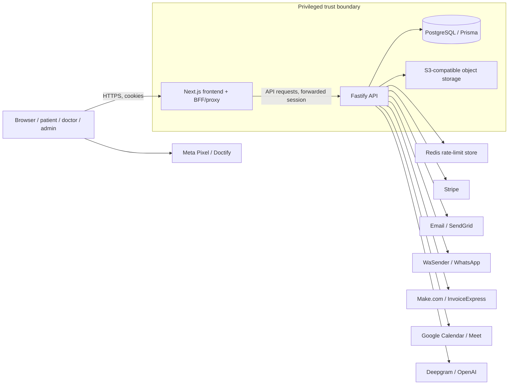

# Go-Live Security & Release Audit — 2026-07-17

> Original audit report as submitted. Reviewed in [go-live-audit-review-2026-07-17.md](go-live-audit-review-2026-07-17.md).

## 1. Executive decision

# NO-GO

- Overall risk: **Critical**
- Findings: **3 Critical, 6 High, 6 Medium, 1 Low, 0 Informational, 2 Warning**
- Unverified release-control areas: **9**
- Deployment must be blocked: **Yes**
- Repository state after audit: **clean; no application changes retained**

Primary reasons:

1. `LOCAL_ADMIN` sessions can access global administrative and financial operations.
2. Multiple clinical PHI routes bypass the central medical-access guard.
3. The credential-rotation checklist is open, while potentially production credentials remain in ignored developer environment files.
4. The frontend possesses an HS256 signing secret that the backend still accepts.
5. Clinical notes are disclosed to Stripe, and patient WhatsApp delivery can proceed without affirmative consent.
6. Backend integration tests and E2E tests did not pass; production headers, TLS, accessibility, and critical journeys remain unverified.
7. Confirmed WCAG 2.2 Level A/AA failures exist.

This audit does not claim the application is completely secure. It establishes that the current evidence is insufficient—and contains confirmed blockers—for a production launch handling health data.

## 2. Scope and limitations

Inspected:

- 2,451 tracked files.
- 128 backend route files, 111 frontend BFF route handlers, 166 frontend pages, and 134 Prisma models.
- Next.js frontend, Fastify API, Prisma/PostgreSQL, authentication/session code, deployment configuration, CI, migrations, tests, generated artifacts, environment metadata, ignored local environment files using redacted presence checks, and Git history where accessible.
- Stripe, S3, Redis, SendGrid/email, Google, Make.com, InvoiceExpress, WaSender, Meta Pixel, Doctify, Deepgram, and OpenAI integration points.

Tested environment:

- Windows local workspace.
- Node `v24.11.1`; project CI/deployment targets Node 22.
- pnpm `10.33.2`.
- Local production Next.js build artifacts and backend TypeScript build.
- Chromium Playwright suite, partially, against a production frontend process.

Limitations:

- Docker Desktop was not running, so the isolated PostgreSQL integration database could not start.
- No authorized preview/staging URL was available; production infrastructure was not probed.
- In-app browser discovery returned no usable browser, so manual browser and assistive-technology testing was unavailable.
- Current dependency vulnerability data was **NOT VERIFIED**: registry audit access was rejected because it would transmit the private dependency graph without separate explicit approval.
- Git-history secret scanning was incomplete because local text-conversion helpers failed.
- Railway settings, branch protection, production secrets, database migrations, backups, TLS, CDN behavior, alerting, and live headers were inaccessible.
- No payment transaction or third-party message was sent.

## 3. Architecture and attack surface

Technology inventory:

- Frontend: Next.js 16.2.6, React 19.2.4, TypeScript 5.9, Tailwind CSS 4, Radix UI, Vitest, Playwright.
- Backend: Fastify 5, Prisma 7.8, PostgreSQL, Zod, JWT, Stripe, S3, Redis, SendGrid, Sharp.
- Build/deployment: pnpm workspaces, standalone Next output, Railway/Nixpacks, Docker for frontend and local PostgreSQL.
- Auth: HttpOnly session cookie; RS256 primary signing with legacy HS256 fallback; database token-version and active-user checks.
- Sensitive data: clinical notes, medical documents, chat, prescriptions, identity, address, tax/VAT data, consent records, payment metadata, doctor banking details, authentication tokens.



Trust boundaries:

- Browser to Next.js.
- Next.js to Fastify.
- API to database/object storage.
- API/browser to third-party processors.
- Role boundary between patient, doctor, corporate admin, local admin, admin, and super admin.

Principal public surfaces:

- `/api/auth/*`, `/api/public/*`, `/api/orders/*`, `/api/payments/*`
- `/api/account/*`, `/api/doctor/*`, `/api/admin/*`, `/api/corporate/*`
- Tokenized `/patient-upload`, `/reviews/rate`, `/share/consults/:token`, `/brazil/consent`
- Public booking, consultation, checkout, certificate, blog, country, legal, and service routes.

Highest-impact attack paths:

1. Compromise a `LOCAL_ADMIN` session → invoke global admin endpoints → expose cross-country data or banking details.
2. Compromise a doctor session → access PHI routes that omit consent/2FA/confidentiality/audit enforcement.
3. Compromise the frontend environment → mint HS256 session tokens accepted by the backend.
4. Leak capability URL through logs/history/referrers → access clinical uploads, shares, payment state, or purchase details.
5. Submit health information in appointment notes → unintended disclosure to Stripe or downstream processors.

The audit maps findings to OWASP ASVS **5.0.0**, the current stable version, and OWASP Top 10 **2025**. [OWASP ASVS](https://owasp.org/www-project-application-security-verification-standard/), [OWASP Top 10:2025](https://owasp.org/Top10/).

## 4. Command and test results

| Command/check | Exit | Result | Release impact |
|---|---:|---|---|
| Attachment and skill reads | 0 | Audit brief read; referenced project security/verification skill files absent | Warning |
| Repository/Git/config inventory | 0 | 2,451 files; initial worktree clean | No |
| `node --version; pnpm --version` | 0 | Node 24.11.1, pnpm 10.33.2 | Node differs from CI target |
| `pnpm install --frozen-lockfile` | 1 | Non-interactive modules purge refused | Recorded; rerun below |
| `CI=true pnpm install --frozen-lockfile` in sandbox | 124 | Network-stalled after recreating `node_modules` | Recorded; rerun below |
| Approved `CI=true pnpm install --frozen-lockfile` | 0 | 830 packages installed; lockfile synchronized | PASS |
| `pnpm typecheck` | 0 | Frontend locale check and both TypeScript projects passed | PASS |
| `pnpm lint` | 0 | Frontend and backend ESLint passed | PASS |
| `pnpm --filter frontend test` | 0 | 12 files, 97/97 tests passed | PASS |
| `pnpm --filter backend test` | 1 | Test guard refused remote Railway DB; 88 files safely blocked | Correct safety behavior; tests not passed |
| `docker compose up -d postgres-test` | 1 | Docker daemon unavailable | Integration gate blocked |
| `pnpm --filter backend test:db` | 1 | 583 tests: 437 pass, 17 fail, 15 cancelled, 114 skipped | **BLOCK** |
| Initial `pnpm build` | 1 | `EBUSY` on `.next` during concurrent local test activity | Recorded |
| `pnpm --filter backend build` | 0 | TypeScript production build passed | PASS |
| `pnpm --filter frontend build` | 0 | Next production build passed; 556 static pages generated | PASS |
| `CI=true pnpm e2e` | 124 | 122 tests started; timed out after 420s; authenticated cases received backend 503 | **BLOCK** |
| `node scripts/check-override-drift.mjs` | 0 | Root/service override sets aligned | PASS |
| Manifest/lock integrity inspection | 0 | Integrity present; no Git/URL/file dependencies detected | PASS |
| `pnpm audit --audit-level=low` | Not run | External dependency-graph disclosure not separately approved | NOT VERIFIED |
| License enumeration commands | 1 | pnpm store package indexes unavailable | NOT VERIFIED |
| Current tracked-secret scan | 0 | No obvious tracked production key patterns found | PASS, current tree only |
| Git-history secret scan | Mixed | Text-conversion failures made history scan incomplete | NOT VERIFIED |
| Redacted ignored-env inspection | 0 | Potentially production credentials and remote DB configuration present | **BLOCK** |
| Static dangerous-sink searches | 0 | No `debugger` or focused tests; one runtime console output; conditional skips present | Warning |
| Local header probes | curl 7 | Ports 3000/4000 closed during probe | NOT VERIFIED |
| Artifact inspection | 0 | 3,425,387 raw JS bytes, 361,802 raw CSS bytes; no client-static source maps | Partial PASS |
| Final `git status --short` | 0 | Clean after reverting generated `next-env.d.ts` change | PASS |

The Playwright configuration also starts the frontend with `next start` even though `output: "standalone"` is enabled; Next warns that standalone deployments should use `node .next/standalone/server.js`.

## 5. Findings

### SEC-001 — Local administrators can invoke global admin operations

- Severity/confidence: **Critical / High**
- CWE/OWASP: CWE-862, CWE-863, CWE-639; A01:2025; ASVS 5 access-control requirements.
- Evidence: `evaluateAdminAccess` (`backend/src/utils/admin-access-evaluator.ts:14`) grants `LOCAL_ADMIN`, `ADMIN`, and `SUPER_ADMIN` equally. `verifyAdminAccess` (`backend/src/utils/admin-auth.ts:34`) preserves that equivalence. Global country operations use only this hook in `backend/src/routes/admin-countries.route.ts:53`; full doctor IBAN reveal does the same in `backend/src/routes/admin-doctor-bank.route.ts:23`.
- Safe reproduction: create a test `LOCAL_ADMIN` for country A; request country B/global configuration, deletion, and bank endpoints.
- Exploit/impact: a compromised local administrator can cross tenant/country boundaries, modify global configuration, process deletion requests, or disclose financial data.
- Root cause: generic "admin tier" authentication is reused where global authorization is required.
- Remediation: introduce `verifyGlobalAdminAccess`; add country/object predicates to every local-admin-compatible endpoint.
- Regression: role × country × operation integration matrix, including negative IDOR cases.
- Verification/block: **FAIL / release blocker**.

### SEC-002 — Clinical routes bypass the medical-access guard

- Severity/confidence: **Critical / High**
- CWE/OWASP: CWE-862, CWE-863, CWE-778; A01/A09.
- Affected routes: medical notes, consultation history, generated documents, Brazil consent, consultation chat/downloads.
- Evidence: `backend/src/routes/doctor-medical-notes.route.ts:18`, `backend/src/routes/doctor-consultation-history.route.ts:8`, `backend/src/routes/doctor-generated-documents.route.ts:99`, `backend/src/routes/consultation-chat.route.ts:655` do not consistently invoke the guard implemented in `backend/src/lib/medical-access-guard.ts:395`.
- Safe reproduction: test each route with missing consent, missing 2FA, confidentiality not accepted, and another doctor's patient.
- Impact: clinical data may be served without required consent, 2FA, alerting, or access logging.
- Root cause: guard invocation is optional and route-local.
- Remediation: enforce the guard through a mandatory pre-handler or PHI repository boundary.
- Regression: enumerate every PHI route and require consent/2FA/confidentiality/ownership/audit assertions.
- Verification/block: **FAIL / release blocker**.

### SEC-003 — Potential production credentials remain unrotated in developer env files

- Severity/confidence: **Critical / High**
- CWE/OWASP: CWE-798, CWE-312; A02/A04.
- Evidence: `docs/guides/credential-rotation.md:3` is explicitly `OPEN` and states production Railway credentials were potentially exposed through developer env files. Redacted inspection found a remote database URL and non-empty authentication, admin, storage, payment, cron, and AI-provider secrets in ignored local files. Values were never printed.
- Safe reproduction: inspect key presence and host classification only; do not display values.
- Impact: unauthorized database, payment, storage, administrative, or third-party access if any credential is genuine and unrotated.
- Root cause: production and development credential boundaries were not maintained.
- Remediation: rotate/revoke every listed credential, remove the production DB URL from local development, invalidate sessions, remove seed credentials, and audit provider access logs.
- Regression: CI secret scanning plus workstation/bootstrap policy preventing production env imports.
- Verification/block: **FAIL / release blocker**.

### SEC-004 — Frontend compromise can mint accepted HS256 sessions

- Severity/confidence: **High / High**
- CWE/OWASP: CWE-321, CWE-347, CWE-798; A04/A07.
- Evidence: the frontend reads `AUTH_JWT_SECRET` and verifies HS256 in `frontend/proxy.ts:112`. The backend retains the same legacy verification path in `backend/src/utils/auth-session.ts:44`. Production configuration explicitly permits the transition state in `backend/src/config/env.ts:280`.
- Scenario: compromise frontend runtime/environment → sign an `ADMIN` or `SUPER_ADMIN` HS256 token → backend accepts it.
- Remediation: remove HS256 verification from both services, remove signing/admin secrets from frontend, rotate the legacy secret, increment token versions, retain only backend private key and frontend/backend public key.
- Regression: reject HS256 tokens for every role; confirm frontend environment contains no signing capability.
- Verification/block: **FAIL / release blocker**.

### SEC-005 — PHI access denial can remain in shadow mode

- Severity/confidence: **High / High**
- CWE/OWASP: CWE-16, CWE-284, CWE-306; A01/A02/A07.
- Evidence: privileged-role 2FA defaults empty and medical enforcement defaults off in `backend/src/config/env.ts:325`. `denyDecision` (`backend/src/lib/medical-access-guard.ts:83`) returns a denial without blocking when enforcement is disabled.
- Scenario: configure `COMPLIANCE_MODE=relaxed`; a denied PHI read proceeds.
- Remediation: prohibit relaxed compliance in production and require medical enforcement, privileged-role 2FA, and admin break-glass reasons at startup.
- Regression: production boot must fail for every unsafe configuration combination.
- Verification/block: **FAIL / release blocker**.

### SEC-006 — Bearer capabilities leak through URLs and ordinary order IDs

- Severity/confidence: **High / High**
- CWE/OWASP: CWE-312, CWE-532, CWE-598, CWE-639, CWE-922; A01/A04.
- Evidence: upload, review, consent, and clinical share tokens appear in query/path URLs; request logging redacts cookies/headers but not URLs in `backend/src/app.ts:22`. A patient-upload token is also stored in plaintext in `backend/prisma/schema.prisma:1906`. Public order receipt/payment routes use the ordinary order ID.
- Scenario: URL reaches proxy logs, browser history, screenshots, analytics, or referrers.
- Remediation: hash capabilities at rest, make them short-lived/single-use/purpose-specific, redact request paths, use one-time POST exchange, and require ownership or a separate receipt capability.
- Regression: prove raw tokens never reach database/logs/referrers and cannot be replayed.
- Verification/block: **FAIL / release blocker**.

### PRIV-001 — Unnecessary health information is transferred to third parties

- Severity/confidence: **High / High**
- CWE/OWASP: CWE-359; A04/A06.
- Evidence: Stripe Checkout receives `appointment.notes`, service name, and consultation type in `backend/src/routes/payments.route.ts:147`. WhatsApp sends proceed unless consent is explicitly `false` in `backend/src/lib/whatsapp/wasender.ts:144`. Make.com receives patient identity/address/tax/invoice information in `backend/src/modules/invoices/generate-invoice.service.ts:31`.
- Scenario: symptoms entered into appointment notes become Stripe product description; omitted consent still permits patient messaging.
- Remediation: send opaque identifiers and generic payment labels; require `patientConsent === true`; minimize Make payloads; verify processor contracts, retention, regions, and deletion.
- Regression: assert third-party payloads contain no clinical text and patient sends fail closed without affirmative consent.
- Verification/block: **FAIL / release blocker**. Qualified privacy/legal review is required; no legal-compliance claim is made.

### OPS-001 — Monitoring, backups, and rollback are not production-ready

- Severity/confidence: **High / High**
- CWE/OWASP: CWE-778; A09/A10.
- Evidence: production frontend errors are discarded by `frontend/app/error.tsx:29`; no monitoring SDK is present. Alerting is optional/log-only. No verified backup restore drill, RPO/RTO, rollback playbook, alert owners, or post-deployment synthetics were found.
- Impact: security, payment, and availability failures may remain undetected; recovery may be improvised.
- Remediation: add PHI-redacted error monitoring, release IDs, uptime/payment/webhook synthetics, named owners, rollback procedure, backups, and a restore drill.
- Regression: simulate failed deployment, failed webhook, frontend exception, and database restore.
- Verification/block: **FAIL / release blocker**.

### A11Y-001 — Confirmed WCAG Level A/AA blockers

- Severity/confidence: **High / High**
- Evidence:
  - Auth-link contrast is only 1.19–1.33:1 against observed backgrounds; lime token at `frontend/app/globals.css:117`.
  - Non-English SSR is emitted with `lang="en"` by `frontend/lib/i18n/get-root-html-lang.ts:25`, corrected only after hydration.
  - 133/166 pages have no local metadata/title.
  - Subscription table rows are click-only in `frontend/app/(admin)/admin/subscriptions/_components/admin-subscriptions-table.tsx:127`.
  - Cookie preferences do not restore focus.
- WCAG: 1.4.3, 3.1.1, 2.4.2, 2.1.1, 4.1.2, 2.4.3.
- Remediation: accessible text color, server-side language, unique localized titles, native buttons/links, and opener focus restoration.
- Regression: axe plus keyboard, screen-reader, zoom/reflow, and localized SSR tests.
- Verification/block: **FAIL / release blocker**.

### SEC-007 — CMS CSS isolation remains parser-unsafe

- Severity: **Medium**
- CWE/OWASP: CWE-79, CWE-116, CWE-693; A05/A02.
- Evidence: backend permits `<style>` in `backend/src/utils/sanitize-html.ts:59`; frontend CSS scoping uses string/brace parsing in `frontend/lib/content/scope-blog-html.ts:40`.
- Remediation/test: remove user CSS, use an actual CSS parser, or sandbox CMS documents; fuzz nested at-rules, escapes, malformed braces, URLs, and selectors.
- Status: **WARNING; resolve before untrusted CMS authors receive access**.

### SEC-008 — Mandatory PHI audit writes can fail open

- Severity: **Medium**
- CWE/OWASP: CWE-778; A09.
- Evidence: audit/alert failures are swallowed in `backend/src/lib/medical-access-guard.ts:210`.
- Remediation/test: fail closed for regulated reads unless a documented emergency mode is activated; inject audit-store failure and verify denial.
- Status: **FAIL**.

### PRIV-002 — Account deletion/anonymization is incomplete

- Severity: **Medium**
- CWE: CWE-359, CWE-459.
- Evidence: request fields are discarded and anonymization retains email, storage keys, appointments, orders, and account/session state in `backend/src/modules/data-policy/country-data-policy.service.ts:123`.
- Remediation/test: define jurisdiction-specific deletion/retention rules, revoke sessions, remove or tombstone storage objects, and produce an auditable completion record.
- Status: **FAIL; legal review required**.

### CI-001 — CI and supply-chain gates are incomplete

- Severity: **Medium**
- CWE/OWASP: CWE-1104, CWE-494; A03/A08.
- Evidence: `.github/workflows/ci.yml:9` includes frozen install, type/lint/build, unit tests, audit, gitleaks, and SHA-pinned actions. It lacks E2E, SAST, dependency review, SBOM/license policy, explicit least-privilege permissions, deployment approval, artifact provenance, and post-deploy smoke.
- Dependency vulnerabilities/outdated state: **NOT VERIFIED**.
- Remediation/test: add missing gates, Dependabot/Renovate, explicit `permissions: contents: read`, CycloneDX SBOM, artifact signing/provenance, environment approval, and smoke tests.
- Status: **FAIL**.

### DEP-001 — Public CSP and deployed headers are not verified

- Severity: **Medium**
- CWE/OWASP: CWE-693; A02.
- Evidence: authenticated portals have a nonce CSP, but public pages receive only a report-only full policy without a collector in `frontend/next.config.ts:58`.
- Remediation/test: collect violations, eliminate required exceptions, enforce public CSP, and verify actual Railway headers/TLS/CORS/cache behavior.
- Status: **NOT VERIFIED / release gate remains open**.

### QA-001 — E2E configuration is not hermetic or release-gating

- Severity: **Medium**
- Evidence: production E2E starts only the frontend and expects a backend on port 4000; authenticated tests failed with 503. It also invokes `next start` despite standalone output in `playwright.config.ts:40`.
- Remediation/test: start an isolated migrated Postgres, backend, and standalone frontend; seed deterministic accounts; add CI E2E gate.
- Status: **FAIL**.

### PERF-001 — No enforced performance budget

- Severity: **Warning**
- Evidence: production artifacts measured 3,425,387 raw JS bytes across 145 files and 361,802 raw CSS bytes across five files. No Lighthouse/LHCI/size budget is enforced.
- Remediation: establish per-route JS/CSS and Core Web Vitals budgets; test throttled mobile profiles in CI.
- Status: **NOT VERIFIED**.

### CACHE-001 — Immutable caching is too broad

- Severity: **Low**
- Evidence: `frontend/next.config.ts:159` assigns one-year immutable caching by extension, including unhashed public assets.
- Remediation/test: restrict immutable caching to hashed assets or version public filenames; verify overwrite behavior.
- Status: **WARNING**.

## 6. Master production checklist

| Control | Status | Evidence |
|---|---|---|
| Stack, routes, state, APIs and trust boundaries inventoried | PASS | Static repository inventory |
| Intended pnpm lockfiles identified | PASS | Root plus documented standalone service lockfiles |
| Manifest/lock synchronization | PASS | Frozen install and override-drift check |
| Runtime/package-manager pinned | WARNING | pnpm pinned; Node range/CI target 22, local 24 |
| Frozen dependency installation | PASS | Exit 0 |
| Production frontend build | PASS | Next build exit 0 |
| Production backend build | PASS | TypeScript build exit 0 |
| Type-check | PASS | Both projects exit 0 |
| Lint | PASS | Both projects exit 0 |
| Frontend unit tests | PASS | 97/97 |
| Backend unit/integration tests | FAIL | 437 pass, 17 fail, 15 cancelled, 114 skipped |
| End-to-end tests | FAIL | Timed out; authenticated requests received backend 503 |
| Focused tests absent | PASS | No `.only` matches |
| Skipped tests explained | WARNING | Conditional DB/credential/matrix skips; current run skipped 114 |
| `debugger` absent | PASS | No matches |
| Production logging minimal | WARNING | One runtime `console.log`; server logging otherwise structured/redacted |
| Direct route and refresh behavior | NOT VERIFIED | No complete live browser run |
| Case-sensitive Linux import behavior | NOT VERIFIED | CI config is Linux, but current CI status inaccessible |
| Client source maps absent locally | PASS | Zero `.map` under `.next/static` |
| Public source-map exposure | NOT VERIFIED | No deployed probe |
| Dependency vulnerabilities | NOT VERIFIED | Registry audit not authorized |
| Git/URL/file dependencies absent | PASS | Lock/manifest scan |
| Lockfile integrity | PASS | Integrity metadata found |
| Suspicious/deprecated packages | NOT VERIFIED | Requires registry/manual review |
| Dependency licenses | WARNING | Incomplete enumeration; Sharp/pizzip/undeclared transitive license require review |
| Automated dependency updates | FAIL | No Dependabot/Renovate config |
| SBOM generation/gate | FAIL | Absent |
| CI secret scanning | PASS | SHA-pinned gitleaks workflow |
| SAST/dependency-review CI | FAIL | Absent |
| No tracked obvious secrets | PASS | Current tracked-tree scan |
| No ignored local production secrets | FAIL | Redacted presence check plus open rotation checklist |
| Secret history clean | NOT VERIFIED | History scan incomplete |
| Example env values non-production | PASS | Placeholder/test values |
| Client receives only public values | FAIL | Frontend contains legacy JWT signing/admin secrets |
| Credential rotation documented and complete | FAIL | Checklist status `OPEN` |
| XSS render-time sanitization | WARNING | Sanitizers present; CSS parser issue remains |
| Dangerous runtime eval/document-write | PASS | No runtime matches |
| Reverse tabnabbing controls | PASS | Sanitizer forces safe link relations |
| Auth tokens excluded from browser storage | PASS | HttpOnly cookie architecture |
| Server-side authorization | FAIL | Local-admin/global and PHI-route bypasses |
| Object-level authorization | FAIL | Confirmed cross-boundary risk |
| Session DB revalidation/token version | PASS | Current user state checked |
| MFA for privileged roles | FAIL | Default empty requirement |
| Cookie flags | PASS | HttpOnly, Lax, production Secure |
| CSRF protection design | PASS | SameSite plus origin guard |
| Logout/session revocation | PASS | Token-version mechanism present |
| CORS static configuration | PASS | Explicit allowlist/fail-closed outside development |
| Live CORS behavior | NOT VERIFIED | No authorized hosted target |
| Rate limiting | PASS | Global plus route overrides |
| Upload size/type controls | PASS | Multipart/file ceilings and validation paths found |
| Upload malware scanning | NOT VERIFIED | No verified malware pipeline |
| Webhook signature/idempotency controls | PASS | Stripe raw body and idempotency code/tests present |
| Race-condition tests | NOT VERIFIED | DB-dependent cases skipped/failed |
| Sensitive-response no-store | PASS | Protected API namespaces receive private/no-store |
| HTTPS/TLS/HSTS | NOT VERIFIED | HSTS configured; live TLS not tested |
| CSP | FAIL | Public policy report-only/no collector |
| Clickjacking/nosniff/referrer/permissions headers | PASS static | Next/Helmet configuration |
| Live headers/cache/MIME behavior | NOT VERIFIED | No hosted probe |
| SPA rewrite/deployment server correctness | WARNING | Next standalone/e2e start mismatch |
| Data minimization | FAIL | Stripe notes and broad processor payloads |
| Patient messaging consent | FAIL | Omitted consent fails open |
| Deletion/anonymization | FAIL | Incomplete workflow |
| Privacy/processor legal review | MANUAL VERIFICATION REQUIRED | Health/payment/AI processors |
| Login/logout/recovery journey | NOT VERIFIED | Backend unavailable during E2E |
| Checkout/payment journey | NOT VERIFIED | No authorized test backend/payment environment |
| Upload/download journey | NOT VERIFIED | No integrated environment |
| Mobile/history/offline/slow-network behavior | NOT VERIFIED | Browser matrix incomplete |
| WCAG automated scan | NOT VERIFIED | Axe unavailable |
| WCAG manual test | MANUAL VERIFICATION REQUIRED | Browser/AT unavailable |
| WCAG blockers | FAIL | Contrast, language, titles, keyboard/focus |
| Reduced-motion/focus/landmarks | PASS static | CSS and shared shells inspected |
| Production bundle measurement | PASS | Raw artifact sizes measured |
| Lighthouse/Core Web Vitals | NOT VERIFIED | No usable browser environment |
| Performance budget | FAIL | No CI budget |
| Global error boundary | PASS | Present |
| Production client-error monitoring | FAIL | No active capture |
| Alert ownership/thresholds | FAIL | Not documented/verified |
| Backups/restore drill | NOT VERIFIED | No evidence |
| Rollback procedure/test | FAIL | No verified playbook/drill |
| Incident response/status communication | NOT VERIFIED | No named operational process |
| CI least privilege | WARNING | SHA-pinned actions; no explicit permissions |
| Production approval/promotion | FAIL | No deployment workflow/environment gate |
| Post-deployment smoke | FAIL | Absent |
| Branch protection/review rules | NOT VERIFIED | GitHub settings inaccessible |

OWASP Top 10:2025 assessment:

- A01 Broken Access Control: **FAIL**
- A02 Security Misconfiguration: **FAIL**
- A03 Software Supply Chain Failures: **NOT VERIFIED / gaps found**
- A04 Cryptographic Failures: **FAIL**
- A05 Injection: **WARNING**
- A06 Insecure Design: **FAIL**
- A07 Authentication Failures: **FAIL**
- A08 Software/Data Integrity Failures: **WARNING**
- A09 Logging and Alerting Failures: **FAIL**
- A10 Mishandling Exceptional Conditions: **FAIL**

## 7. Changes made

No application fixes were implemented; the request was handled as an audit.

Audit-generated changes:

- Next production build changed `frontend/next-env.d.ts`; it was restored to the original tracked content.
- `.next`, backend `dist`, Playwright, and test-result artifacts were generated only in ignored build/output locations.
- Final tracked worktree was clean.

Tests executed afterward:

- Frozen install.
- Type-check.
- Lint.
- Frontend unit tests.
- Backend unit/integration attempt.
- Frontend and backend production builds.
- Production-mode Playwright attempt.
- Static security, secret, dependency-integrity, artifact, CI, accessibility, and configuration inspections.

## 8. Release blockers

1. Restrict `LOCAL_ADMIN` to country-scoped operations; protect global configuration, deletion, and doctor banking.
2. Enforce the medical-access guard on every PHI route.
3. Rotate/revoke potentially exposed production credentials and remove production DB access from local env files.
4. Remove the HS256 session fallback and all signing/admin secrets from the frontend.
5. Prohibit PHI shadow mode and require privileged-role 2FA/break-glass enforcement in production.
6. Remove clinical notes/classification from Stripe and other unnecessary processor payloads.
7. Require affirmative patient consent for every patient WhatsApp communication.
8. Replace URL/plaintext bearer capabilities with hashed, expiring, single-use, purpose-scoped tokens.
9. Resolve WCAG contrast, language, page-title, keyboard, and focus blockers.
10. Make backend integration and E2E suites pass in an isolated full-stack environment.
11. Implement production error monitoring, alert ownership, backups, restore testing, and rollback.
12. Verify current dependency vulnerabilities and deployed TLS, headers, CSP, CORS, source maps, and smoke journeys.

## 9. Prioritized improvements

Before launch:

- Resolve all 12 blockers above.
- Complete credential rotation and provider access-log review.
- Run migrations and full test suites against an isolated production-equivalent database.
- Add enforcing public CSP after a monitored report-only period.
- Complete qualified health/privacy/payment legal review.

Within 7 days after blockers:

- Add E2E, SAST, dependency-review, SBOM/license, provenance, deployment approval, and smoke-test CI gates.
- Add Dependabot/Renovate.
- Replace optional PHI audit logging with fail-closed behavior.
- Correct deletion/anonymization semantics.

Within 30 days:

- Add Lighthouse/Core Web Vitals and bundle budgets.
- Pin container base images by digest.
- Add synthetic payment/webhook and critical-journey monitoring.
- Perform full WCAG 2.2 AA manual testing with screen readers and zoom/reflow.

Longer-term hardening:

- Centralize PHI access at a repository/policy boundary.
- Perform an authorized external penetration test.
- Conduct quarterly restore and incident-response exercises.
- Establish continuous threat-model and processor inventory reviews.

## 10. Deployment verification commands

```powershell
# Toolchain and reproducible install
node --version
pnpm --version
$env:CI = "true"
pnpm install --frozen-lockfile
# Generate Prisma client FIRST — stale client silently breaks typecheck/build
pnpm --filter backend exec prisma generate
# Static release gates
pnpm typecheck
pnpm lint
pnpm --filter frontend test
node scripts/check-override-drift.mjs
pnpm build
# Isolated backend integration tests
docker compose up -d postgres-test
pnpm --filter backend test:db:setup
pnpm --filter backend test:db
# Dependency review — requires explicit approval to send dependency metadata
pnpm audit --audit-level=low
pnpm outdated --recursive
# Full-stack E2E against an authorized preview/staging deployment
$env:E2E_BASE_URL = "https://preview.example.com"
$env:E2E_NO_WEBSERVER = "1"
$env:CI = "true"
pnpm e2e
# Railway state
railway status
railway logs
# Headers and TLS
curl.exe -sSI https://preview.example.com/
curl.exe -sSI https://preview.example.com/login
curl.exe -sSI https://api-preview.example.com/api/health
# CORS denial test
curl.exe -i -X OPTIONS `
  -H "Origin: https://evil.example" `
  -H "Access-Control-Request-Method: POST" `
  https://api-preview.example.com/api/auth/login
# Direct and nested-route behavior
curl.exe -sS -o NUL -w "%{http_code}`n" https://preview.example.com/login
curl.exe -sS -o NUL -w "%{http_code}`n" https://preview.example.com/account/bookings
curl.exe -sS -o NUL -w "%{http_code}`n" https://preview.example.com/doctor/appointments
# Public source maps and accidentally exposed files
curl.exe -sS -o NUL -w "%{http_code}`n" https://preview.example.com/.env
curl.exe -sS -o NUL -w "%{http_code}`n" https://preview.example.com/package.json
curl.exe -sS -o NUL -w "%{http_code}`n" https://preview.example.com/.git/config
curl.exe -sS -o NUL -w "%{http_code}`n" https://preview.example.com/_next/static/chunks/app.js.map
# Database migration state
pnpm --filter backend db:deploy
pnpm --filter backend exec prisma migrate status
```

The standalone production E2E server command should be changed to the equivalent of:

```powershell
node frontend/.next/standalone/server.js
```

rather than `next start` when `output: "standalone"` is enabled.

## 11. Final go-live gate

- [ ] No unresolved Critical vulnerabilities
- [ ] No unresolved High vulnerabilities
- [ ] No exposed secrets or credentials
- [ ] Production dependencies reviewed
- [x] Clean frozen-lockfile installation succeeds
- [x] Lint succeeds
- [x] Type-check succeeds
- [ ] Automated tests succeed
- [x] Production build succeeds
- [ ] Critical user journeys pass
- [ ] Authentication verified
- [ ] Server-side authorization verified
- [ ] Security headers verified
- [ ] HTTPS and TLS verified
- [ ] CSP verified
- [ ] CORS verified
- [x] CSRF protections verified where applicable
- [ ] No unintended source maps or sensitive public files
- [ ] Browser and mobile checks pass
- [ ] WCAG 2.2 AA blockers are resolved
- [ ] Performance meets documented budgets
- [ ] Error monitoring is active
- [ ] Sensitive information is redacted from logs and telemetry
- [ ] Rollback procedure is documented and tested
- [ ] Production smoke tests pass
- [x] Final release decision is documented
